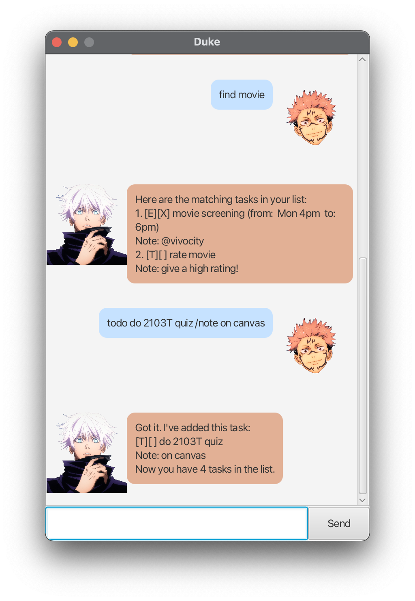

# User Guide

## Quick start 
1. Have Java 11 installed on your device.
2. Download the latest version of Duke from [here](https://github.com/benjamin-wee/ip/releases).
3. Copy the file to the folder you want to use as the home folder for Duke.
4. Double-click the file to start the app.
5. Enter your command in the text box and press enter to execute command. Refer to the features below on the various commands.

## Features 

### Feature - Todo

Adds a Todo task into the list of tasks.

#### Usage

Format of usage:
` todo <description> `

Expected outcome:
```
Got it. I've added this task: 
[T][] <description> 
Note: There are no notes!
Now you have <number of tasks in list> tasks in the list.
```

### Feature - Deadline 

Adds a Deadline task into the list of tasks.

#### Usage

Format of usage: 

`deadline <description> /by <deadline in YYYY-MM-DD format> `

Expected outcome: 
```
Got it. I've added this task:
[D][] <description> (by: d MMM YYYY) 
Note: There are no notes! 
Now you have <number of tasks in list> tasks in the list.
```

### Feature - Event 

Adds an Event task into the list of tasks 

#### Usage 

Format of usage:

`event <description> /from <start> /to <end>`

Expected outcome:
```
Got it. I've added this task:
[E][] <description> (from: <start> to: <end>) 
Note: There are no notes!
Now you have <number of tasks in list> tasks in the the list. 
```

### Feature - List

Displays all tasks in the current tasklist.

#### Usage 

Format of usage: 

`list`

Example outcome:

```
1. [D][] CS2103T iP submission (by: 17 Feb 2023)
Note: left with one increment!
2. [T][] read book 
Note: There are no notes!
3. [E][] watch movie premiere (from: 4pm to: 6pm)
Note: screening at vivocity
```

If there are no tasks in the list, 

```
There are no tasks as of now!
```

### Feature - Mark 
Marks task as completed. 

#### Usage

Format of usage: 

`mark <index of task>`

Example outcome: 

```
Nice! I've marked this task as done:
[D][X] CS2103T iP submission (by: 17 Feb 2023)
Note: left with one increment!
```

If there is no task at the given index,
```
There is no task of that index!
```

### Feature - Unmark
Unmarks task to uncompleted.

#### Usage

Format of usage:

`unmark <index of task>`

Example outcome:

```
Okay, I've marked this task as undone:
[D][] CS2103T iP submission (by: 17 Feb 2023)
Note: left with one increment!
```

If there is no task at the given index,
```
There is no task of that index!
```

### Feature - Delete 

Deletes task from task list.

#### Usage 

Format of usage:

`delete <index of task>`

Example outcome:

```
Noted. I've removed this task:
[D][] CS2103T iP submission (by: 17 Feb 2023)
Note: left with one increment!
```

If there is no task at the index given, 

```
There is no task of that index!
```

### Feature - Find 
Finds tasks in the current list based on matching keyword 

#### Usage 

Format of usage: 

`find <keyword>`

Example outcome:

```
Here are the matching tasks in your list: 
1. ...
2. ...
3. ... 
```

If there are no matching tasks,

```
There are no tasks with the given keyword
```

### Feature - Note 

Attaches a note to the tasks added to the task list.

#### Usage 

Format of usage: 

Refer to above Todo, Deadline, Event features' usages. 

`<todo/deadline/event> ... ... /note <note to attach>`

Expected outcome:
```
1.[T][] watch movie 
Note: Location is vivocity 
```

If the field `<note to attach>` is empty or if /note is excluded from the command,

```
1.[T][] watch movie 
Note: There are no notes!
```

### Feature - Bye

Exits the Duke program after displaying goodbye message for five seconds.

#### Usage 

Format of usage:

`bye`

Expected outcome:
```
Bye. Hope to see you again soon!
```